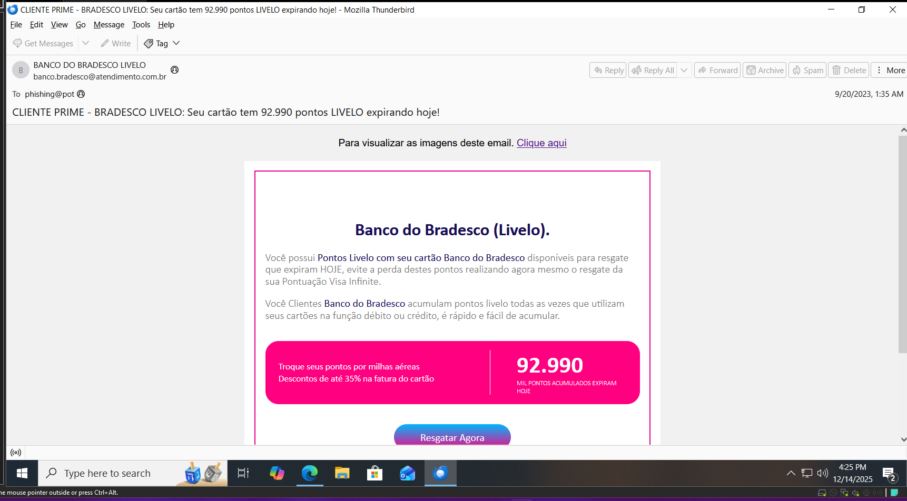

# Lab 1: Phishing Email

# 1. Kiến thức cần có

## **1. Phishing Email là gì?**

- Nguồn gốc của từ **Phishing** là sự kết hợp của 2 từ: **Fishing for information** (câu thông tin) và **phreaking** (trò lừa đảo). Vì có sự tương quan về mặt ý nghĩa giữa việc “câu cá” và “câu thông tin người dùng”, hình thức này được phát hiện lần đầu tiên vào năm 1987.
- Nội dung của **Phishing Email** được thiết kế gần giống với giao diện ngân hàng, tổ chức. Người dùng dễ dàng bị "lừa" nếu không để ý và tin rằng đó là email thật, sau đó họ dễ dàng cung cấp những **thông tin** cá nhân quan trọng như: **Mật khẩu** đăng nhập hệ thống, **mật khẩu** giao dịch, thẻ tín dụng và các thông tin tuyệt mật khác.

## 2. Các loại Phishing Email phổ biến

- Phishing Email giả mạo thông báo Email Doanh Nghiệp overload data.
- Phishing Email giả mạo đặt hàng.
- Phishing Email giả mạo cơ quan nhà nước.
- Phishing Email giả mạo người quen cũ.
- Phishing Email giả mạo thanh toán online.
- Phishing Email giả mạo thông báo quá hạn thanh toán.
- Phishing Email giả mạo thông báo trúng thưởng.
- …

## 3. Các thành phần của một email

### 1. Header

- Routing / Transport (đường đi của mail)
  ```powershell
  Received:
  Received:
  Received:
  ```
- Authentication (xác thực)
  ```powershell
  Authentication-Results:
  Received-SPF:
  ```
  → SPF / DKIM / DMARC / CompAuth
- Identity (ai gửi – ai nhận)
  ```powershell
  From:
  To:
  Return-Path:
  Message-Id:
  Date:
  Subject:
  ```
  → Phần này dễ bị giả → SOC phải đối chiếu với routing.
- Anti-spam / Mail gateway verdict
  ```powershell
  X-MS-Exchange-Organization-SCL: 5
  X-Microsoft-Antispam: BCL:9;
  ```

### 2. Body

- Nội dung body bắt đầu từ một khối base64 lớn sau một dòng space. Khi decode, chính là nội dung html đã thấy.

### 3. Link & Attachment

- Link(URL) : mục tiêu là đưa user tới:
  - Trang giả mạo đăng nhập
  - Trang tải malware
- Attachment
  Các loại nguy hiểm:
  - `.html` → fake login page
  - `.docm` → macro
  - `.zip` → che giấu file thực thi
  - `.exe` → malware trực tiếp

# 2. Chuẩn bị:

- Tải và cài đặt thunderbird để phân tích email
- Tải một email phishing mẫu để phân tích

[https://github.com/rf-peixoto/phishing_pot/blob/main/email/sample-1.eml](https://github.com/rf-peixoto/phishing_pot/blob/main/email/sample-1.eml)

# 3. Phân tích email:



## Bước 1: — Identity


- Kiểm tra các trường:

```powershell
Subject:
CLIENTE PRIME - BRADESCO LIVELO: Seu cartão tem 92.990 pontos LIVELO expirando hoje!

From:
BANCO DO BRADESCO LIVELO <banco.bradesco@atendimento.com.br>

Return-Path:
root@ubuntu-s-1vcpu-1gb-35gb-intel-sfo3-06
```

- Brand: `Banco Bradesco` ( ngân hàng Brazil )
- Domain gửi: [`atendimento.com.br`](atendimento.com.br) → không phải Domain chính thức của ngân hàng này
- `Return-Path: root@ubuntu-s-1vcpu-1gb-35gb-intel-sfo3-06`
  → Return-Path là trường gửi trở lại các thông báo lỗi,… Ở đây nó gửi lại một máy ubuntu

⇒ Kết luận sơ bộ: kiểu Phishing Email là spoofed brand

## Bước 2: — Received Chain

- Đọc `Received` từ dưới lên

```powershell
Received: from ubuntu-s-1vcpu-1gb-35gb-intel-sfo3-06 (137.184.34.4)
```

- Trường `Received` ở dưới cùng này chỉ ra nơi nó xuất phát đầu tiên
  - Hệ điều hành: Ubuntu Linux
  - Cấu hình: 1 vCPU – 1GB RAM – 35GB disk
  - Không phải máy ngân hàng
  - Là VPS dựng sẵn

🚨 Ngân hàng thật KHÔNG gửi email từ VPS kiểu này

Sau đó mail đi qua:

- `...prod.protection.outlook.com` / `outlook.office365.com` / `prod.outlook.com`
  → Đây chỉ là hệ thống Microsoft nhận và chuyển thư, không phải nguồn gửi thật.

→ IOC cần ghi là IP address `137.184.34.4`

## BƯỚC 3 — Authentication (SPF / DKIM / DMARC)

- Lý thuyết:
  - `SPF` (Sender Policy Framework): bản ghi liệt kê các IP được phép gửi email thay cho domain
  - `DKIM` (DomainKeys Identified Mail) : thêm chữ ký số để xem email có bị sửa trong khi gửi không
  - `DMARC` (Domain-based Message Authentication, Reporting, and Conformance): chính sách xử lý khi email đó là giả
  - `CompAuth` : kết luận cuối cùng của hệ thống mail xem email này có đáng tin hay


- Ta thấy `spf` = `temperror` là không xác thực được
- `dkim` = `none` là không ký email
- `dmarc` = `temperror` là không bảo vệ domain
- `compauth` = `fail` Microsoft đánh giá email này không đáng tin

## Bước 4: — Phân tích body

- Link khi bấm `Clique aqui` hoặc decode base64 trong body email
  ```powershell
  https://blog1seguimentmydomain2bra.me/
  ```
  → domain hoàn toàn không liên quan đếnBradesco

→ IOC cần ghi là Domain [`blog1seguimentmydomain2bra.me`](http://blog1seguimentmydomain2bra.me)

# 4. Kết luận cho email này

- Nguồn gửi: VPS linux ( root@ubuntu)
- IP source: 137.184.34.4
- SPF: temperror
- DKIM: none
- DMARC: temperror
- CompAuth: fail
- Link dẫn tới domain lạ
- **IOC:**
  - IP: `137.184.34.4`
  - Domain: `blog1seguimentmydomain2bra[.]me`

→ Phán quyết: Phishing-Brand Impersonation ( Credential Phishing)

→ Action: block IP + IOC

# 5. Mapping MITRE ATT&CK

- TACTIC: Initial Access
- Technique chính: `T1566` - Phishing
- Sub-technique: `T1566.002` - Phising: Spearphishing Link
  - Vì link này dẫn tới fake login để đăng nhập vào ngân hàng giả, từ đó ngân hàng giả này lấy được thông tin đăng nhập ngân hàng của nạn nhân
