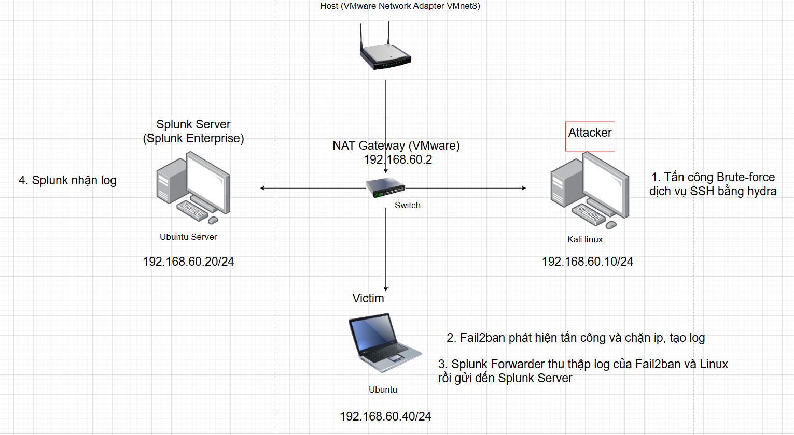

# Lab 4: Phát hiện và điều tra tấn công Brute-Force dịch vụ SSH trên linux

# I. Mục tiêu

- Mục tiêu của bài lab là xây dựng một môi trường SOC cơ bản để mô phỏng, thu thập và phát hiện tấn công Brute-Force SSH trên hệ điều hành Linux, thông qua việc sử dụng Fail2ban để chặn IP tấn công, ghi nhận hành vi trên endpoint và Splunk để tập trung log, phân tích và cảnh báo sự kiện an ninh.

# II. Sơ đồ mạng, môi trường và công cụ



1. Tấn công Brute-force dịch vụ SSH bằng hydra
2. Fail2ban chặn IP của kẻ tấn công nếu phát hiện nhập sai nhiều lần và tạo log trên máy ubuntu
   - Fail2ban là một công cụ bảo mật trên Linux dùng để phát hiện và chặn (ban) các IP có hành vi đăng nhập thất bại lặp lại, phổ biến nhất là brute-force SSH.
3. Splunk Forwarder thu thập log của Fail2ban và Linux rồi gửi đến Splunk Server
4. Splunk Server tiếp nhận log

### Các bước cài đặt và cấu hình fail2ban trên ubuntu

1. Cài Fail2ban

```bash
sudo apt update
sudo apt install -y fail2ban
```

- Kiểm tra service:

```bash
sudo systemctl status fail2ban --no-pager
```

- Nếu chưa chạy:

```bash
sudo systemctlenable --now fail2ban
```

2. Tạo file cấu hình riêng

Không sửa trực tiếp **`jail.conf`**. Tạo `jail.local` (Fail2ban tự tìm file cấu hình ưu tiên hơn là `jail.local` và ghi đè vào file `jail.conf`)

```bash
sudo cp /etc/fail2ban/jail.conf /etc/fail2ban/jail.local
```

Mở file:

```bash
sudo nano /etc/fail2ban/jail.local
```

1. Cấu hình bảo vệ SSH (sshd)

Trong `jail.local`, tìm phần `[sshd]` và chỉnh (hoặc thêm mới đoạn này nếu không có):

```
[sshd]
enabled =true
port = ssh
logpath = /var/log/auth.log
maxretry =5
findtime =10m
bantime =15m
backend = systemd
```

Giải thích nhanh:

- `enabled=true`: bật jail sshd
- `logpath`: nơi đọc log SSH (Ubuntu: `/var/log/auth.log`)
- `maxretry/findtime`: sai 5 lần trong 10 phút thì ban
- `bantime`: ban 15 phút
- `backend=systemd`: đọc log qua systemd/journal (ổn cho Ubuntu mới)

Lưu file và thoát.

1. Restart fail2ban để áp dụng cấu hình

```bash
sudo systemctl restart fail2ban
sudo systemctl status fail2ban --no-pager
```

1. Add monitor cho fail2ban.log

```bash
sudo /opt/splunkforwarder/bin/splunk add monitor /var/log/fail2ban.log -sourcetype fail2ban -index linux_logs
```

# III. Mô phỏng tấn công brute-force ssh từ máy kali vào ubuntu

1. **Kiểm tra cổng SSH có mở không**

   ```bash
   nc -vz 192.168.60.40 22
   ```

   - `v` (Verbose): Chế độ "chi tiết". Nó yêu cầu chương trình hiển thị thông báo về tình trạng kết nối (thành công hay thất bại) lên màn hình.
   - `z` (Zero-I/O mode): Chế độ "không quét dữ liệu". Nó quét các cổng để xem chúng có phản hồi hay không mà không thiết lập một phiên làm việc đầy đủ hoặc gửi bất kỳ dữ liệu nào.

2. Tấn công bằng Hydra trên máy Kali

   - Cú pháp cơ bản của hydra
     `hydra [tùy_chọn] <dịch_vụ>://<target>`
     - `l user` : 1 username
     - `L users.txt` : danh sách username
     - `p pass` : 1 mật khẩu
     - `P passwords.txt` : danh sách mật khẩu
     - `s port` : chỉ định cổng
     - `t n` : số thread (mặc định 16)
     - `V` : hiển thị chi tiết từng lần thử
     - `f` : dừng khi tìm thấy mật khẩu đúng

   ```powershell
   hydra -l phong -P password.txt -V ssh://192.168.60.40
   ```


# IV. Điều tra và phát hiện

1. Kiểm tra nhanh bằng log của `auth.log` và `fail2ban.log`

   

   → phát hiện 6 lần đăng nhập thất bại bằng dịch vụ ssh

   

   → trên fail2ban.log cũng phát hiện 6 lần đăng nhập thất bại và fail2ban đã tự ban IP của máy tấn công là 192.168.60.10

2. Kiểm tra bằng Splunk

- SPL `index=linux_logs sourcetype=fail2ban`


- Vì tôi đặt `timeban`khi cấu hình fail2ban là 15 phút nên nó sẽ tự gỡ chặn (Unban) IP sau 15’

1. Xác nhận xem có đăng nhập thành công không

- SPL
  ```powershell
  index=linux_logs sourcetype=linux_secure
  (src="192.168.60.10" OR "192.168.60.10")
  ```


- Thấy có Accepted password → mật khẩu đã bị đoán đúng, có thể attacker đã đăng nhập thành công

# V. Phân tích và báo cáo

- Tóm tắt: phát hiện đăng nhập thất bại nhiều lần bằng dịch vụ ssh, nghi ngờ tấn công brute-force và fail2ban đã phát hiện và chặn IP tấn công
- Time: `2026-01-12 21:23:27`
- host = `phong` (tên máy đã tạo ra log)
- source = `/var/log/fail2ban.log`
- IOC
  - src_ip: 192.168.60.10
  - victim_host: phong
  - service: ssh (sshd)
- Severity: High: vì có Accepted password từ IP attacker, dù fail2ban đã ban sau đó
- Hành động ứng phó: đổi mật khẩu user
- Alert SPL: có IP bị fail2ban ban
  ```powershell
  index=linux_logs sourcetype=fail2ban " Ban "
  | rex "Ban\s+(?<src_ip>\d+\.\d+\.\d+\.\d+)"
  | stats count by src_ip host
  ```
  - `index=linux_logs sourcetype=fail2ban " Ban "`
    - Chỉ tìm trong **index `linux_logs`**
    - Chỉ log có **sourcetype `fail2ban`**
    - Và trong nội dung log có chữ **Ban** (tức fail2ban đã ban IP)
    ➡️ Nghĩa: “Tìm các sự kiện fail2ban ban IP”.
  - `| rex "Ban\s+(?<src_ip>\d+\.\d+\.\d+\.\d+)"`
    - `rex` = dùng regex để **tách IP** sau chữ `Ban`
    - Tạo field mới tên là `src_ip`
    Ví dụ log: `... Ban 192.168.60.10`
    → tách ra `src_ip=192.168.60.10`
  - `| stats count by src_ip host`
    - Gom nhóm theo `src_ip` và `host`
    - `count` = số lần ban trong khoảng thời gian search
    ➡️ Kết quả sẽ là bảng kiểu:
    src_ip | host | count
- MAPPING MITRE ATT&CK
  - Credential Access: **T1110 Brute Force**
  - Lateral Movement: T1021 Remote Service - SSH
