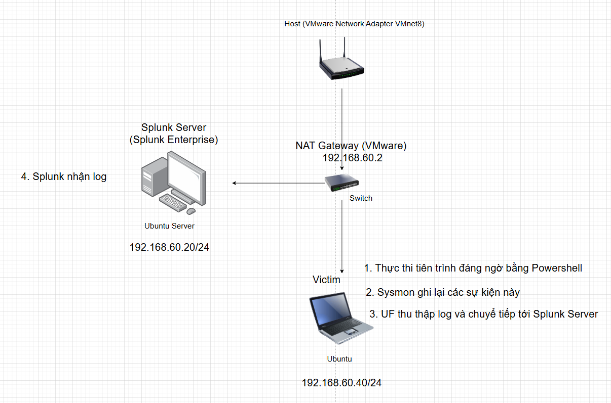

# Lab 6: Điều tra hoạt động Powershell đáng ngờ trên Windows

## I. Mục tiêu

Mục tiêu của Lab này là phát hiện, điều tra và phản ứng với các hoạt động PowerShell độc hại hoặc trái phép trên máy tính Windows bằng cách sử dụng Sysmon và Splunk. Trọng tâm là xác định các lệnh PowerShell đáng ngờ, các tập lệnh được mã hóa và các hoạt động như tải xuống tệp hoặc thực thi từ các đường dẫn không chuẩn.

## II. Sơ đồ mạng, môi trường và công cụ



- Thêm cấu hình UF theo dõi và gửi log của Powershell
  - Mở file inputs.conf của UF
    ```powershell
    notepad "C:\Program Files\SplunkUniversalForwarder\etc\system\local\inputs.conf"
    ```
  - Thêm dòng sau ( lưu ý là tạo thêm index = powershell_logs trên Splunk để chứa log của Powershell)
    ```powershell
    [WinEventLog://Microsoft-Windows-PowerShell/Operational]
    disabled = false
    index = powershell_logs
    sourcetype = WinEventLog:PowerShell
    ```
    
  - Bật tính năng ghi log chi tiết để ép windows ghi lại mọi câu lệnh đã gõ trên powershell
    ```powershell
    New-Item -Path "HKLM:\SOFTWARE\Policies\Microsoft\Windows\PowerShell\ScriptBlockLogging" -Force
    Set-ItemProperty -Path "HKLM:\SOFTWARE\Policies\Microsoft\Windows\PowerShell\ScriptBlockLogging" -Name "EnableScriptBlockLogging" -Value 1
    ```
  - Khởi động lại UF
    ```powershell
    C:\WINDOWS\system32>&"C:\Program Files\SplunkUniversalForwarder\bin\splunk.exe" restart
    ```

## III. Mô phỏng tấn công bằng Powershell

- Tải xuống tập tin đáng ngờ
  ```powershell
  Invoke-WebRequest -Uri "https://secure.eicar.org/eicar.com.txt" -OutFile "$env:USERPROFILE\Downloads\eicar.com.txt"
  ```

  - `Invoke-WebRequest`: Lệnh dùng để gửi yêu cầu HTTP/HTTPS ra internet (tương tự như curl hay wget).
  - `Uri "https://secure.eicar.org/eicar.com.txt"`: Địa chỉ tải về.
    - EICAR Test File là một chuỗi ký tự vô hại (được phát triển bởi Viện Nghiên cứu Chống Virus Máy tính Châu Âu) nhưng tất cả các phần mềm diệt virus chuẩn trên thế giới đều phải nhận diện nó là virus.
  - `OutFile ...`: Lưu file tải về vào thư mục `Downloads` với tên `eicar.com.txt`.
  - `USERPROFILE` là biến môi trường đại diện cho thư mục gốc của người dùng đang đăng nhập.

## IV. Phát hiện và điều tra bằng Splunk

- Kiểm tra trên log của sysmon
  ```powershell
  index="sysmon" sourcetype="XmlWinEventLog:Sysmon"
  ```
  ```powershell
  01/31/2026 06:07:20.777 PM
  LogName=Microsoft-Windows-Sysmon/Operational
  EventCode=11
  EventType=4
  ComputerName=DESKTOP-NDBEF0H
  User=NOT_TRANSLATED
  Sid=S-1-5-18
  SidType=0
  SourceName=Microsoft-Windows-Sysmon
  Type=Information
  RecordNumber=14498
  Keywords=None
  TaskCategory=File created (rule: FileCreate)
  OpCode=Info
  Message=File created:
  RuleName: Downloads
  UtcTime: 2026-01-31 11:07:20.775
  ProcessGuid: {e237abb6-e264-697d-b707-000000002400}
  ProcessId: 2060
  Image: C:\Windows\System32\WindowsPowerShell\v1.0\powershell.exe
  TargetFilename: C:\Users\po230\Downloads\eicar.com.txt
  CreationUtcTime: 2026-01-31 11:07:20.775
  User: DESKTOP-NDBEF0H\po230
  ```
  ```powershell
  01/31/2026 06:07:22.365 PM
  LogName=Microsoft-Windows-Sysmon/Operational
  EventCode=22
  EventType=4
  ComputerName=DESKTOP-NDBEF0H
  User=NOT_TRANSLATED
  Sid=S-1-5-18
  SidType=0
  SourceName=Microsoft-Windows-Sysmon
  Type=Information
  RecordNumber=14500
  Keywords=None
  TaskCategory=Dns query (rule: DnsQuery)
  OpCode=Info
  Message=Dns query:
  RuleName: -
  UtcTime: 2026-01-31 11:07:19.837
  ProcessGuid: {e237abb6-e264-697d-b707-000000002400}
  ProcessId: 2060
  QueryName: secure.eicar.org
  QueryStatus: 0
  QueryResults: ::ffff:89.238.73.97;
  Image: C:\Windows\System32\WindowsPowerShell\v1.0\powershell.exe
  User: DESKTOP-NDBEF0H\po230
  ```
- Kiểm tra log của powershell
  ```powershell
  index="powershell_logs" sourcetype="WinEventLog:PowerShell"
  ```
  ```powershell
  01/31/2026 06:07:19.552 PM
  LogName=Microsoft-Windows-PowerShell/Operational
  EventCode=4104
  EventType=5
  ComputerName=DESKTOP-NDBEF0H
  User=NOT_TRANSLATED
  Sid=S-1-5-21-89911650-480286385-2846434076-1001
  SidType=0
  SourceName=Microsoft-Windows-PowerShell
  Type=Verbose
  RecordNumber=284
  Keywords=None
  TaskCategory=Execute a Remote Command
  OpCode=On create calls
  Message=Creating Scriptblock text (1 of 1):
  Invoke-WebRequest -Uri "https://secure.eicar.org/eicar.com.txt" -OutFile "$env:USERPROFILE\Downloads\eicar.com.txt"

  ScriptBlock ID: d8897c34-228a-4eb9-b56b-52b930fc0a1a
  Path:
  ```
- Thời gian sự kiện vào khoảng `01/31/2026 06:07:19.552 PM`
- EventCode `4104` là PowerShell Script Block
  - Có user đã thực thi lệnh tải xuống bằng PowerShell
    ```powershell
    Invoke-WebRequest -Uri "https://secure.eicar.org/eicar.com.txt" -OutFile "$env:USERPROFILE\Downloads\eicar.com.txt"
    ```
- EventCode `22` là DNSEvent (DNS Query) \*\*\*\*
  - Tiến trình PowerShell (PID 2060) gửi yêu cầu DNS **Event 22**.
  - Truy vấn tên miền: `secure.eicar.org`.
  - Nhận về IP đích: `89.238.73.97`.
- EventCode `11` là File Create
  - File độc hại `eicar.com.txt` được ghi thành công vào thư mục `Downloads`.
- Các chỉ số xâm phạm (IOCs - Indicators of Compromise)
  - **Domain**`secure.eicar.org` , nguồn log: Sysmon Evt 22, PS Evt 4104
  - **IP Address**`89.238.73.97`, nguồn log: Sysmon Evt 22
  - **File Name**`eicar.com.txt` , nguồn log: Sysmon Evt 11, PS Evt 4104
  - **File Path**`C:\Users\po230\Downloads\` , nguồn log: Sysmon Evt 11
  - **User Account**`DESKTOP-NDBEF0H\po230` , nguồn log: Tất cả log

## V. Phản ứng sự cố

1. Chặn tiến tình độc hại
   - Xác định và kill tiến trình PowerShell độc hại
     ```powershell
     Stop-Process -Id 2060 -Force
     ```
2. Chặn IP độc hại

   ```powershell
   New-NetFirewallRule -DisplayName "Block Malicious EICAR IP" -Direction Outbound -Action Block -RemoteAddress 89.238.73.97
   ```

- `Direction Outbound`: Chặn chiều đi từ trong máy ra ngoài Internet

1. Tạo Alert

   ```powershell
   index="sysmon" EventCode=1 (CommandLine="*Invoke-WebRequest*" OR CommandLine="*EncodedCommand*")
   ```
